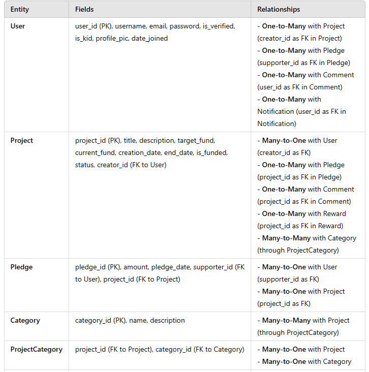

# crowdfunding_back_end
A repo to contain my She Codes Crowdfunding back end project

## `README.md` Template Phase 1: API Plan

As your Crowdfunding back end grows, you'll have more and more information to put in the `readme.md` file. For now, you have a rough plan for your project, so let's mark it down!

Below is a template you can use to add your plan to your readme. As usual, {{ double brackets }} indicate places where you should insert your own content. So if your name was Sinead O'Connor, you would swap `Hi, my name is {{ your_name_here }}!` to `Hi, my name is Sinead O'Connor!`

If you're looking for a good way to create your Schema diagram in VS Code, check out [the draw.io integration extension for VS Code](https://marketplace.visualstudio.com/items?itemName=hediet.vscode-drawio)!

To make editing tables in Markdown easier, you might enjoy [the Markdown All-In-One extension](https://marketplace.visualstudio.com/items?itemName=yzhang.markdown-all-in-one). With this installed, you can hit tab inside of any "cell" in a table, and the editor will automatically resize all your columns and create a new row if necessary.

```markdown
# Crowdfunding Back End
{{ Geng Liu }}

## Planning:
### Concept/Name
{{ to provide a platform for kids to upload their own projects which need supports with a goal, and other people can pledge to support the existing submitted projects }}

### Intended Audience/User Stories
{{ Who are your intended audience? - Kids to upload the projects, pledge is open to public
How will they use the website? - kids to upload their own projects which need supports with a goal, and other people can pledge to support the existing submitted projects}}

### Front End Pages/Functionality
- {{ A page on the front end }}
    - {{ A list of dot-points showing functionality is available on this page }}
    - {{ etc }}
    - {{ etc }}
- {{ A second page available on the front end }}
    - {{ Another list of dot-points showing functionality }}
    - {{ etc }}

### API Spec - refer the api_spec.png file
{{ Fill out the table below to define your endpoints. An example of what this might look like is shown at the bottom of the page. 

It might look messy here in the PDF, but once it's rendered it looks very neat! 

It can be helpful to keep the markdown preview open in VS Code so that you can see what you're typing more easily. }}

| URL | HTTP Method | Purpose | Purpose | Request Body | Success Response Code | Authentication/Authorisation |
| --- | ----------- | ------- | ------- | ------------ | --------------------- | ---------------------------- |
|     |             |         |         |              |                       |                              |

### DB Schema

```

An example API spec:  


Link to the deployed project: https://crowdfundinggl-f670add671c7.herokuapp.com/

ERD

refer to file erd.drawio


REST API Endpoints
User Endpoints
    1. POST /api/users/register: Registers a new user.
    2. POST /api/users/login: Authenticates and logs in a user.
    3. GET /api/users/{user_id}/: Retrieves user profile details.
    4. PUT /api/users/{user_id}/: Updates user profile information.
Project Endpoints
    1. POST /api/projects/: Creates a new project. Only allowed if is_kid is True.
    2. GET /api/projects/: Lists all projects, with filters for category, funding status, etc.
    3. GET /api/projects/{project_id}/: Retrieves project details, including comments and pledges.
    4. PUT /api/projects/{project_id}/: Updates project details, only accessible to the project creator.
    5. DELETE /api/projects/{project_id}/: Deletes a project, only accessible to the creator or an admin.
Pledge Endpoints
    1. POST /api/projects/{project_id}/pledges/: Creates a new pledge for a project by a user.
    2. GET /api/projects/{project_id}/pledges/: Lists all pledges for a project.
    3. DELETE /api/projects/{project_id}/pledges/{pledge_id}/: Cancels a pledge (may depend on project status).



